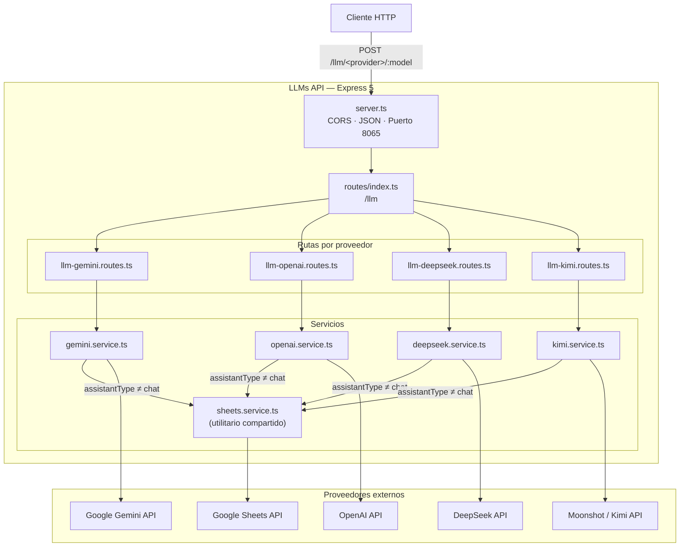
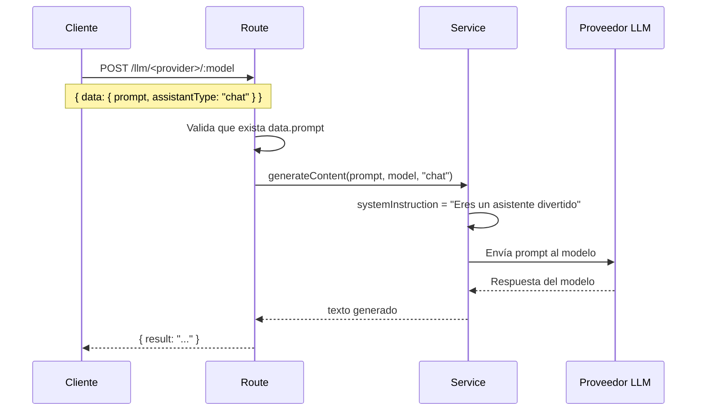
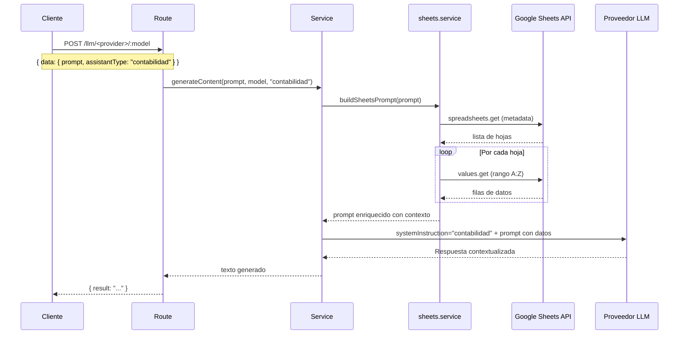

# LLMs API

API unificada que actúa como proxy hacia múltiples proveedores de modelos de lenguaje (LLMs), exponiendo una interfaz consistente independiente del proveedor.

> Desarrollado con **Node 24**, **TypeScript ESM** y **Express 5**. Desplegado vía Docker en el puerto `8065`.

---

## Tabla de contenidos

- [Arquitectura](#arquitectura)
- [Flujo de petición](#flujo-de-petición)
- [Proveedores y modelos](#proveedores-y-modelos)
- [Referencia de endpoints](#referencia-de-endpoints)
- [Variables de entorno](#variables-de-entorno)
- [Instalación y ejecución](#instalación-y-ejecución)

---

## Arquitectura



---

## Flujo de petición

### Modo `chat` (por defecto)



### Modo con contexto de Google Sheets

Cuando `assistantType` es distinto de `"chat"`, el valor se usa como instrucción de sistema y el prompt se enriquece automáticamente con los datos de la planilla Google Sheets configurada.



---

## Proveedores y modelos

| Proveedor | Prefijo de ruta | Modelos disponibles | SDK |
|-----------|----------------|---------------------|-----|
| **Gemini** | `/llm/gemini` | `gemini-2.0-flash` · `gemini-2.0-flash-lite` · `gemini-2.5-pro-preview-05-06` | `@google/generative-ai` |
| **OpenAI** | `/llm/openai` | `gpt-4o` · `gpt-4o-mini` · `o4-mini` | `openai` (Responses API) |
| **DeepSeek** | `/llm/deepseek` | `deepseek-chat` · `deepseek-reasoner` | `openai` + baseURL custom |
| **Kimi** | `/llm/kimi` | `moonshot-v1-8k` · `moonshot-v1-32k` · `moonshot-v1-128k` | `openai` + baseURL custom |

---

## Referencia de endpoints

### `GET /`

Retorna el estado del servidor y los proveedores registrados.

**Respuesta**
```json
{
  "status": "ok",
  "providers": ["gemini", "openai", "kimi", "deepseek"]
}
```

---

### `GET /llm/{provider}`

Lista los modelos disponibles para el proveedor indicado.

| Parámetro | Tipo | Descripción |
|-----------|------|-------------|
| `provider` | path | `gemini` \| `openai` \| `deepseek` \| `kimi` |

**Ejemplo — `GET /llm/gemini`**
```json
{
  "provider": "gemini",
  "models": ["gemini-2.0-flash", "gemini-2.0-flash-lite", "gemini-2.5-pro-preview-05-06"]
}
```

**Ejemplo — `GET /llm/openai`**
```json
{
  "provider": "openai",
  "models": ["gpt-4o", "gpt-4o-mini", "o4-mini"]
}
```

**Ejemplo — `GET /llm/deepseek`**
```json
{
  "provider": "deepseek",
  "models": ["deepseek-chat", "deepseek-reasoner"]
}
```

**Ejemplo — `GET /llm/kimi`**
```json
{
  "provider": "kimi",
  "models": ["moonshot-v1-8k", "moonshot-v1-32k", "moonshot-v1-128k"]
}
```

---

### `POST /llm/{provider}/{model}`

Envía un prompt al modelo especificado y retorna la respuesta generada.

| Parámetro | Tipo | Descripción |
|-----------|------|-------------|
| `provider` | path | `gemini` \| `openai` \| `deepseek` \| `kimi` |
| `model` | path | Identificador del modelo (ver tabla de modelos disponibles) |

**Cuerpo de la petición**

```jsonc
{
  "type": "encripted",       // opcional — reservado para futura lógica de desencriptado
  "data": {
    "prompt": "string",      // requerido — pregunta o instrucción para el modelo
    "assistantType": "string" // opcional — controla el comportamiento del asistente (ver abajo)
  }
}
```

**Campo `assistantType`**

| Valor | Comportamiento |
|-------|---------------|
| `"chat"` (default) | Usa instrucción de sistema predeterminada: *"Eres un asistente de chat, respondes de forma divertida"* |
| Cualquier otro string | El valor se usa directamente como instrucción de sistema. Además, el prompt se enriquece automáticamente con el contexto de la planilla Google Sheets configurada. |

**Respuesta exitosa — `200 OK`**
```json
{
  "result": "Texto generado por el modelo..."
}
```

**Error de validación — `400 Bad Request`**
```json
{
  "error": "El campo \"prompt\" es requerido."
}
```

**Error del proveedor — `500 Internal Server Error`**
```json
{
  "error": "Error al generar el contenido."
}
```

**Ejemplo — modo chat**
```bash
curl -X POST http://localhost:8065/llm/gemini/gemini-2.0-flash \
  -H "Content-Type: application/json" \
  -d '{
    "data": {
      "prompt": "¿Cuál es la capital de Francia?"
    }
  }'
```

**Ejemplo — modo con contexto de planilla**
```bash
curl -X POST http://localhost:8065/llm/deepseek/deepseek-chat \
  -H "Content-Type: application/json" \
  -d '{
    "data": {
      "prompt": "¿Cuánto se recaudó en total el mes pasado?",
      "assistantType": "Eres un asistente contable experto, responde de forma precisa y concisa."
    }
  }'
```

---

## Variables de entorno

Crea el archivo `../envs/llms.env` relativo a la raíz del repositorio (usado por Docker Compose):

```env
# Claves de proveedores (incluir solo las que se vayan a usar)
GEMINI_API_KEY=...
OPENAI_API_KEY=...
DEEPSEEK_API_KEY=...
KIMI_API_KEY=...

# Integración Google Sheets (requerido para assistantType != "chat")
SHEETS_SPREADSHEET_ID=...
```

Adicionalmente, coloca el archivo de cuenta de servicio de Google en `../envs/credentials-excel.json`. Docker lo monta en el contenedor como `credentials.json`.

---

## Instalación y ejecución

### Con Docker (recomendado)

```bash
docker compose up --build
```

La API quedará disponible en `http://localhost:8065`.

### Desarrollo local

```bash
cd app
npm install
npm run dev      # hot reload con ts-node
```

La API quedará disponible en `http://localhost:3000`.

### Otros comandos

```bash
npm start        # sin hot reload
npm run build    # type-check y compilación TypeScript
```
